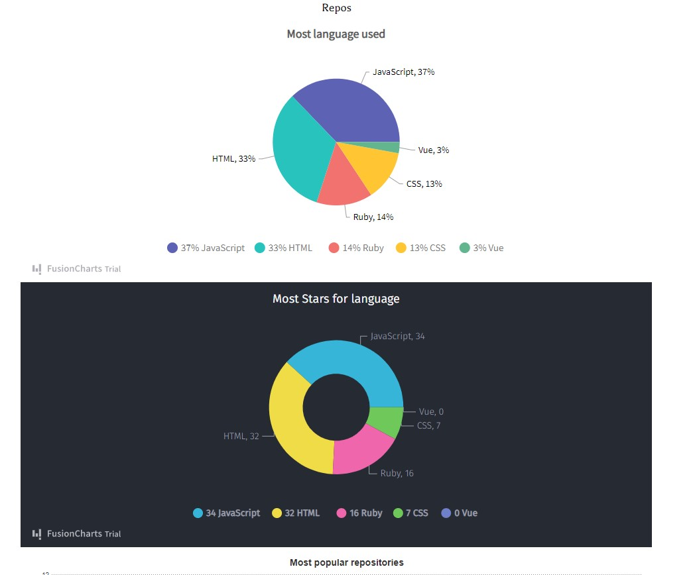

<h1>Github Stats</h1>

This is a react project that uses context api,useContext hook for state management. oAuth is used for registration and login functionality. To show different statistic, FushionChart library was used. FushionChart is a library that provides different chart and graph related components. Using this project users will be able to find out github users statistic in a presentable and easy way.





</h1>Additional description about the project and its features.</h1>

<h2>Built With</h2>

- React
- FushionChart
- Context Api
- useReducer,useContext hooks
- Vanila javascript
- Tailwind

<h2>Getting Started</h2>
To get a local copy up and running follow these simple example steps.

```
- first clone the repository
- use your terminal
- go to the project directory using cd (directory name)
- run "npm install" to install all the dependencies
- run "npm run start"

```

<h2>Prerequisites for this project</h2>

```
- A good text editor (ex.Vscode)
- Github profile
- Git installed in your local machine
```

<h2>Limitations of the project</h2>

```
- No live link is available for this project.

```

<h2>Authors</h2>

👤 Author1

Github: @ajkacca457

Twitter: @ajkacca

Linkedin: https://www.linkedin.com/in/avijit-karmaker-8738a54a/

<h2> 🤝 Contributing</h2>

Contributions, issues and feature requests are welcome!

Feel free to check the issues page.

Show your support
Give a ⭐️ if you like this project!

 <h2> 📝 License</h2>
This project is a personal project of Avijit.
